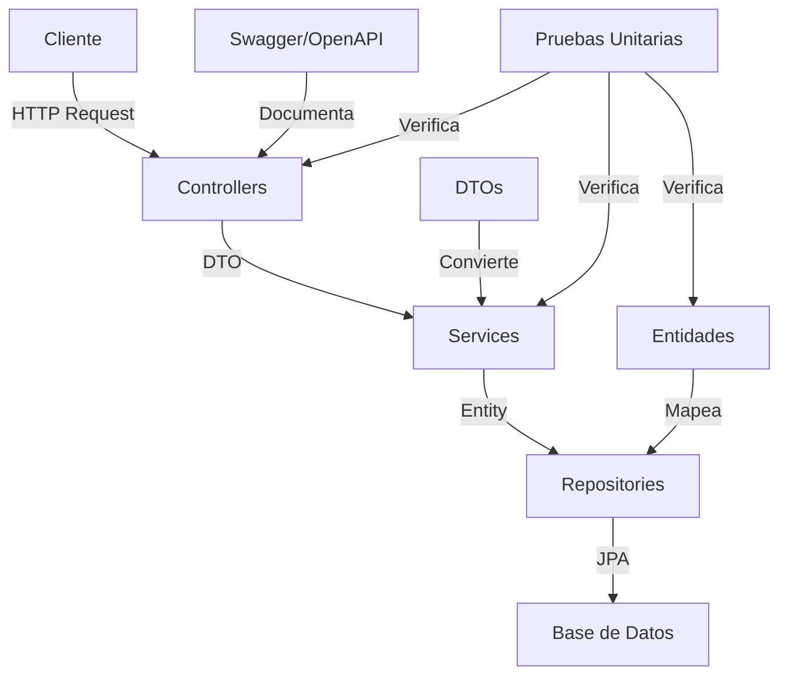

# 🛍️ Demo Cardinalidad - Spring Boot API
#PROBANDO PIPELINE
## 📝 Descripción
Este proyecto es una API REST desarrollada con Spring Boot que demuestra las relaciones de cardinalidad entre entidades, específicamente entre Productos y Categorías. Implementa una arquitectura moderna con DTOs, pruebas unitarias y documentación Swagger.

##  workflow GitFlow
Este proyecto utiliza el modelo de ramificación **GitFlow** para organizar el desarrollo. Las ramas principales son:

-   `main`: Contiene el código estable que está en producción.
-   `develop`: Es la rama de integración donde se unen todas las nuevas funcionalidades.

Todo el trabajo nuevo se realiza en una rama `feature` que nace de `develop` y vuelve a ella a través de un **Pull Request** para ser revisado por el equipo.

## 🏗️ Arquitectura
El proyecto sigue una arquitectura en capas, implementando el patrón DTO para la transferencia de datos:



## 🚀 Características
- ✨ CRUD completo para Productos y Categorías
- 📊 Relaciones de cardinalidad Many-to-One
- 🔄 Conversión DTO para transferencia de datos
- 📚 Documentación Swagger/OpenAPI
- ✅ Pruebas unitarias completas
- 🔐 Manejo de errores HTTP

### Módulo de Clientes (En Desarrollo)
Actualmente se está trabajando en la implementación del CRUD (Crear, Leer, Actualizar, Eliminar) para la entidad **Cliente**. El trabajo se está realizando en la rama `feature/cliente`.

## 🛠️ Tecnologías
- Java 17
- Spring Boot 3.2.3
- Spring Data JPA
- MySQL
- Lombok
- SpringDoc OpenAPI (Swagger)
- JUnit 5 & Mockito
- Maven

## 📋 Requisitos Previos
- ☕ Java 17 o superior
- 📦 Maven
- 🗄️ MySQL

## 🔧 Configuración
1. Clona el repositorio:
```bash
git clone https://github.com/yourusername/demoCardinalidad.git
```

2. Configura la base de datos en `application.properties`:
```properties
spring.datasource.url=jdbc:mysql://localhost:3306/tu_base_de_datos
spring.datasource.username=tu_usuario
spring.datasource.password=tu_contraseña
```

3. Ejecuta la aplicación:
```bash
mvn spring-boot:run
```

## 🌐 Endpoints API

### Productos
- GET `/api/v1/producto` - Obtener todos los productos
- GET `/api/v1/producto/{id}` - Obtener un producto por ID
- POST `/api/v1/producto` - Crear un nuevo producto
- PUT `/api/v1/producto/{id}` - Actualizar un producto
- DELETE `/api/v1/producto/{id}` - Eliminar un producto

### Categorías
- GET `/api/v1/categoria` - Obtener todas las categorías
- GET `/api/v1/categoria/{id}` - Obtener una categoría por ID
- POST `/api/v1/categoria` - Crear una nueva categoría
- PUT `/api/v1/categoria/{id}` - Actualizar una categoría
- DELETE `/api/v1/categoria/{id}` - Eliminar una categoría

## 📚 Documentación
La documentación de la API está disponible a través de Swagger UI:
- 🔍 Swagger UI: `http://localhost:8080/swagger-ui.html`
- 📄 OpenAPI JSON: `http://localhost:8080/api-docs`

## 🧪 Pruebas
El proyecto incluye pruebas unitarias completas para:
- 📦 Modelos (Producto, Categoria)
- 🔧 Servicios (ProductoService, CategoriaService)
- 🎮 Controladores (ProductoController, CategoriaController)

Para ejecutar las pruebas:
```bash
mvn test
```

## 📊 Estructura del Proyecto
```
src/
├── main/
│   ├── java/
│   │   └── com/utp/demoCardinalidad/
│   │       ├── config/
│   │       ├── controller/
│   │       ├── dto/
│   │       ├── model/
│   │       ├── repository/
│   │       └── service/
│   └── resources/
└── test/
    └── java/
        └── com/utp/demoCardinalidad/
            ├── controller/
            ├── model/
            └── service/
```

## 🤝 Contribuir
Las contribuciones son bienvenidas. Por favor, sigue estos pasos:
1. 🍴 Fork el proyecto
2. 🔨 Crea tu rama de características
3. 📝 Commit tus cambios
4. 🚀 Push a la rama
5. 🎉 Abre un Pull Request

## 📄 Licencia
Este proyecto está bajo la Licencia MIT. Ver el archivo [LICENSE](LICENSE) para más detalles.

## ✨ Autor
- 👨‍💻 [Tu Nombre]
- 📧 [Tu Email]
- 🔗 [Tu GitHub]
